<h1 align="center">Hi there, I'm Theeraphat Jantakat 👋</h1>

<h3 align="center">Software Engineer / Full Stack Developer</h3>

  I am a passionate developer with over 10 years of experience specializing in creating beautiful and functional web, mobile, and desktop applications. Based in Bangkok, Thailand.

---

## 🛠️ Technology Stack & Skills

  

## 🏆 GitHub Trophies

  

## 📊 GitHub Stats

  <!-- Use GitHub Readme Stats Action locally to prevent 503 limits -->
  
  

  <!-- GitHub Readme Streak Stats -->
  

## 📫 Get In Touch

  
  
  
  
  

